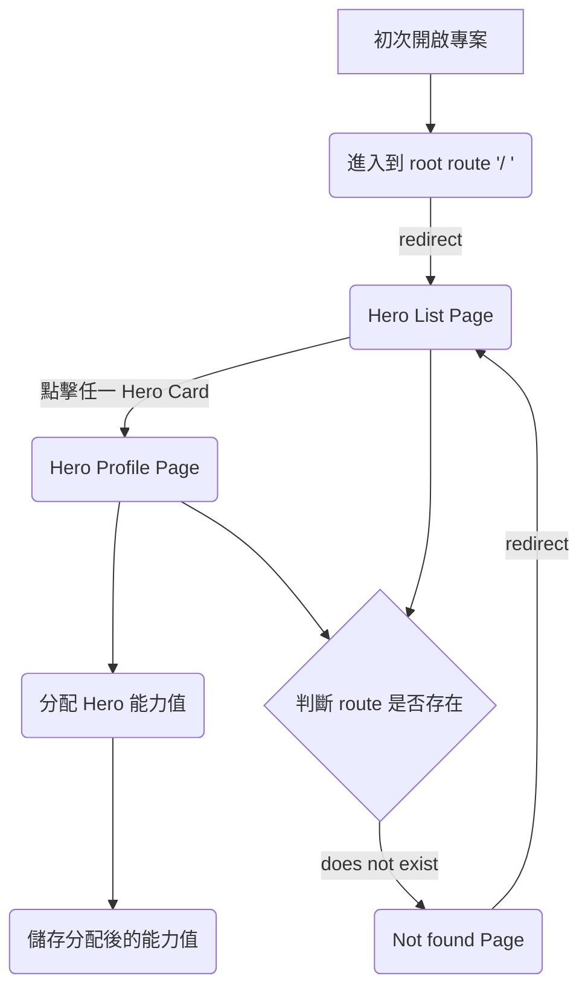
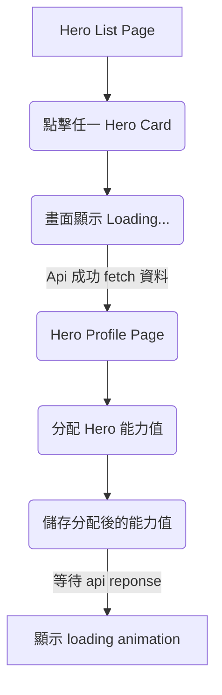

# 安裝

以下將會引導你如何安裝此專案到你的電腦上。

Node.js 版本建議為：`16.15.1` 以上

## 取得專案

```bash
git clone https://github.com/brook110413/hahow-project.git
```

## 移動到專案內

```bash
cd hahow-project
```

## 安裝套件

```bash
npm install
```

or

```bash
yarn install
```

## 運行專案

```bash
npm run dev
```

or

```bash
yarn dev
```

### 開啟專案

在瀏覽器網址列輸入以下即可看到畫面

```bash
http://localhost:5173/
```

# 專案資料夾、Web 邏輯說明

以下說明會主要針對 `/src` 資料夾來說明

## 專案資料夾

- assets - 靜態資源放置處
  - i18n
- components - 共用元件放置處
  - CustomBackdrop
  - CustomCard
- configs - 專案配置放置處
  - routes - router 配置
- pages - 畫面放置處
  - HeroListPage
  - HeroProfilePage
  - NotFoundPage
- redux - redux 資料放置處
- styles - 全域樣式處裡放置處
  - theme.js - MUI 全域客製化樣式
- utils - 共用邏輯、小工具放置處

## Web 邏輯架構

### Router

- router 邏輯
  - 當開啟專案進入到 `/` route，會自動 redirect 到 `/heroes`
- error handling
  - 當 user 輸入不存在的 route 時，會自動 redirect 到 `NotFoundPage` ，並且 1 秒後 redirect 到 `/heroes`
  - 當 user 進入到 `/heroes/:heroId` ，輸入的 `:heroId` 在 API response 內不存在時，自動 redirect 到 `NotFoundPage`

以流程圖表示



### 等待 api response 處理

- 當從 Hero List Page 進入到 Hero Profile Page 時，在 api 成功會回傳結果前，會先讓 user 看到 `Loading...` ，讓 user 知道目前這邊正在等待資料的處理
- 當 user 更新完 hero profile 的能力數值後，按下儲存按鈕，立即跑出 loading 的 animation，等 api 回傳 ok 以後便會消失，讓 user 了解這部分在等待資料的處理

以流程圖表示



# 第三方 library

- vite v4.1.0
  - 現代化的打包工具，大幅的加快開發模式的 server 啟動時間和 HMR(熱更新) 的時間
- eslint v8.33.0
  - 統一專案的程式碼寫作方式，避免其他協作成員參與導致程式碼風格不統一
- prettier v2.8.4
  - 可自動處理程式排版，增加可讀性
- husky v8.0.3
  - 建立 pre-commit hook，讓每一次 commit 都跑設定好的 script，確認無問題才能成功送出 commit
  - 目前此專案主要有跑的是 prettier 和 lint
- react-router-dom v6.8.1
  - 處理 react router 的配置
  - 目前專案使用的是 v6.4 上的版本，使用 createBrowserRouter 等 API 來建置 router，並且能設定在進入特定的 route 後做畫面的資料處理
- react-redux v8.0.5
  - 管理 react 的全域 state
  - 處理同步、分同步的資料
  - 此專案使用 Redux Toolkit 來做 redux 的設定
- material-ui v5.11.8
  - 目前最多人使用的 react css framework
  - v5 之後提供 emotion、styled-component 等 CSS-in-JS library 來設定樣式
  - 可依需求客製化共用的 theme，保持專案的樣式統一性
- react-i18next v12.1.5
  - 處理多國語系的開發
